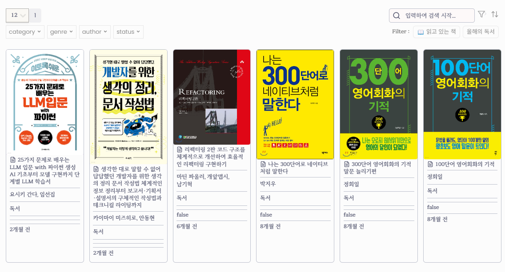
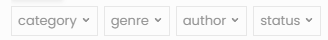
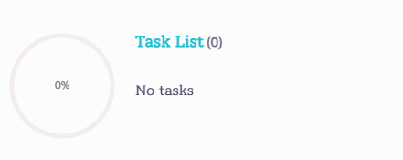

obsidian-dataviewjs-template-table 

위의 레포를 플러그인으로 변환하였습니다

# Obsidian page data viewer


## 필수 플러그인

본 플러그인을 사용하려면 반드시 dataview 플러그인이 필요합니다

## 작성형식

````
```page-table
header: 제목 # 선택
pages: "#독서" # dataview 쿼리
filterList : [tags, status, category, genre, author]
rows : [cover_url, file.link, author, tags, book_note, status, rTime_created]   # 선택  | 작성하지 않을 경우 기본 값 "file.link"
selectedValue : 12 # 선택 | 작성하지 않을 경우 기본 값 10
filter : # 선택
- label: # 필터 목록에 표시할 이름
  type: # tags나 property, file.변수 사용가능 
  target: # tags의 이름이나 property 속성명 또는 file.변수에서 포함시킬 대상
  target_content: # property를 사용시 선택 | target이 property인 경우 target의 내용을 비교하기 위한 변수
  target_isInclude: # 선택 | target이 type에 포함되어 있는지 판별, property와 사용하는 경우, target이 null인지 체크하는 역할
- label: 📕 완독서
  type: property
  target: status
  target_content: true

- label: 📖 읽고 있는 책
  type: property
  target: status
  target_content: false

- label: eBook만
  type: property
  target: category
  target_content: eBook

- label: 영어공부만
  type: property
  target: genre
  target_content: 영어

- label: 프로그래밍만
  type: tags
  target: 프로그래밍
  target_isInclude: true

- label: 올해의 독서
  type: property
  target: created
  target_content: 2024-01-01 ~ now

filterDefault: [올해의 독서] # 선택
sort :  # 선택
- label: 완독일순 (최신순)  # 정렬 목록에 표시할 이름
  type: finish_read_date # property나 file.cday, file.mday 등
  sort: desc # asc or desc
- label: 완독일순 (오래된순)
  type: finish_read_date
  sort: asc

cls: 클래스명 # 선택
options: [tasksView] # 선택

```
````

## 변수

- pages: dataview의 pages와 동일
- rows: (선택) 표시될 row목록, 기본값 : file.link
	- cover_url: 페이지 내의 이미지를 가져오거나 미리 property로 설정된 cover_url 이미지를 가져옴
	- rTime_(file.cday나 created 등) : 상대적으로 시간을 표시해줌
- header: (선택) 제목추가
- selectedValue: (선택) 한번에 표시될 페이지 수, 기본값 : 10
- filterList: (선택) filter와 동일하지만 필터 선택 모달을 생성
	- 
- filter : (선택) 테이블 필터링
	- 변수목록
		- label : 표시될 값을 작성
		- type: tags나 property, file.변수 사용가능
		- target: tags의 이름이나 property 속성명 또는 file.변수에서 포함시킬 대상
		- target_content : property를 사용할 경우 target의 내용을 비교하기 위한 변수
		- target_isInclude : (true/ false) tags나 property가 해당 md 문서에 존재하는지 판단
- filterDefault : (선택) filter 중 기본적으로 사용하고 싶은 필터가 있을 경우 해당 필터의 label을 작성해서 사용
- sort : (선택) sort를 추가할 수 있음
- sortDefault : (선택) sort 중에서 기본적으로 사용하고 싶은 필터가 있을 경우 해당 번호 작성 (0부터 시작하므로 주의)
- cls: (선택) 해당 테이블에 클래스 추가 가능
- options: (선택) 
	- tasksView : 밑 부분에 pages의 task를 표시해줌
 		- 
  - noPagination : pagination 없앰


## CSV 지원

````
```page-table-csv
pages: "etc/csv/좋아하는_노래.csv" 
```
````

필터 기능을 제외한 변수를 모두 사용할 수 있습니다.


## Tasks View 지원


````
```page-tasks
```
````

현재 페이지의 tasks 목록을 확인 할 수 있습니다.

````
```page-tasks
pages: "#독서"
```
````

pages 변수를 통해 tasks 목록을 볼 페이지를 지정할 수 있습니다.
